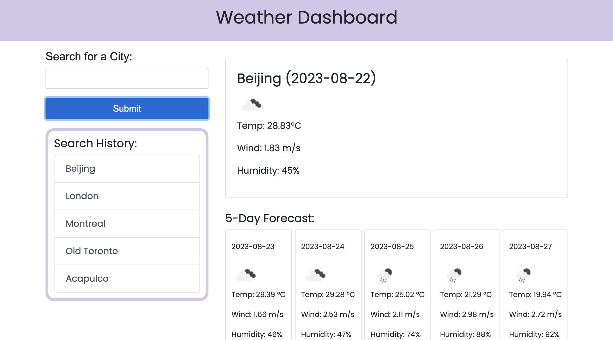

# Weather Dashboard

## Description
This webpage was developed to demonstrate my knowledge of thirdparty APIs, JavaScript, JQuery and Bootstrap. It allows users to search by city and get the current weather and forecast for the next 5 days. The searches are saved on a local storage and displayed on the page so it is easier for the user to revisit. 

## Installation 
N/A

## Usage
https://rileysong01.github.io/weather-dashboard/

To use this webpage, you can put in a city name and view the weather and forecast for that city. Click on buttons in the search history tab to revisit your recent searches.

## Credits
N/A

## License
Please refer to the LICENSE in the repo.